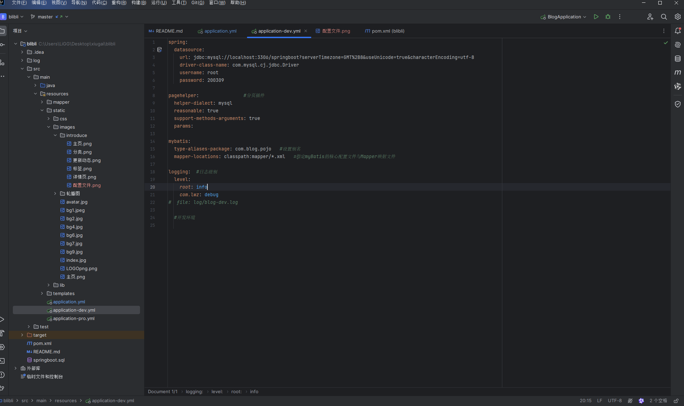
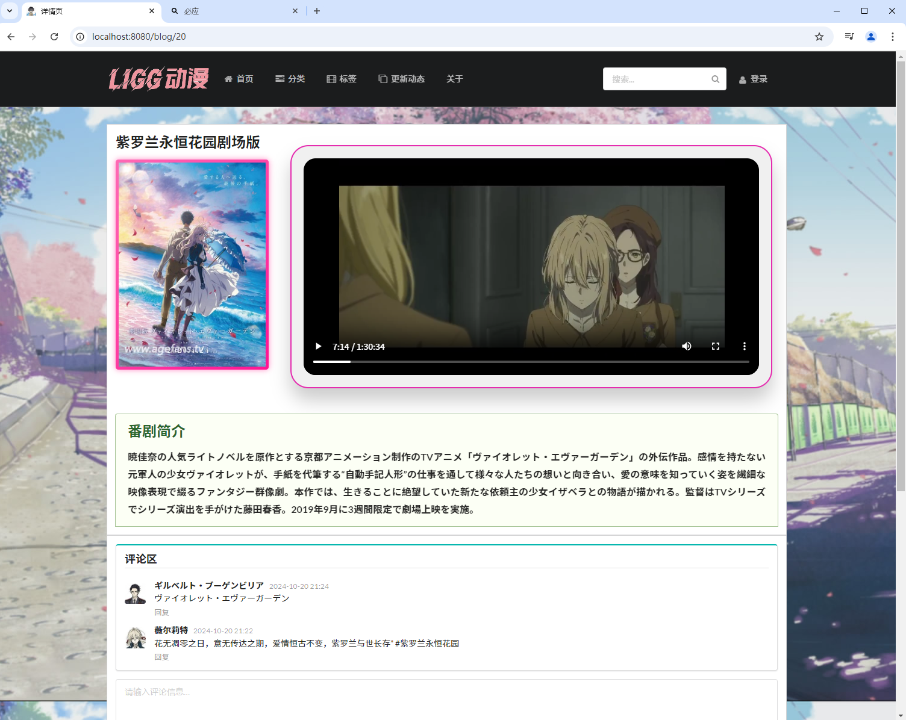
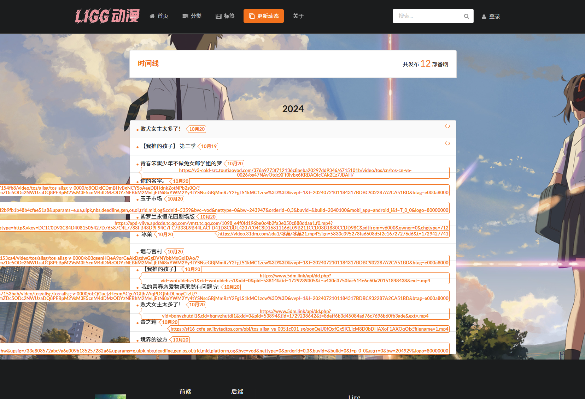

# blibli
###### 基于springboot+mybatis开发的动漫发布网站基于springboot+mybatis开发的动漫发布网站

**开发环境**
1. 编程软件：[IntelliJ IDEA 2023.3.6](https://www.jetbrains.com/help/idea/2023.3/managing-plugins.html?preferences.pluginManager&utm_source=product&utm_medium=link&utm_campaign=IU&utm_content=2023.3 "IntelliJ IDEA 2023.3.6")
2. JDK：[jdk17](https://www.oracle.com/java/technologies/javase/jdk17-archive-downloads.html "jdk17")
3. Springboot版本： [2.2.5](https://start.spring.io/ "2.2.5")
4. mybatis [2.1.1](https://mybatis.net.cn/ "2.1.1")
5. 前端ui模板 [semantic-ui.](https://semantic-ui.com/ "semantic-ui.")
6. Thymeleaf模板（用于前端发送请求、接收响应）[Thymeleaf](https://www.thymeleaf.org/ "Thymeleaf")

| 前端技术栈 | 后端技术栈 |
| ---------- | ---------- |
|      semantic-ui      |   springboot         |
|     thymeleaf       |  mybatis          |

## 功能/开发计划

- [x] 后台登录
- [x] 后台视频发布/编辑
- [x] 后台分类发布/编辑
- [x] 后台标签发布/编辑
- [x] user注销
- [x] 前端首页内容展示
- [x] 番剧详情页
- [x] 番剧评论
- [x] 番剧视频页展示
- [x] 分类/标签也展示与关联
- [x] 介绍页面设计
- [ ] 评论回复功能
- [ ] 管理员/普通用户登录
- [ ] 用户编辑个人信息功能
- [ ] 页面UI美化

**本地部署步骤**

- 创建mysql数据库

  *创建名为springboot数据库并且导入项目中的springbootsql文件*
 

- 修改配置文件
  *配置全局文件*

  

设置配置文件中的数据库信息，将数据库连接地址、usrname(账号)、password(密码)、设置成本地自己的*

- 启动项目

  *下载完maven依赖运行BlibliApplication启动类，启动完毕访问 http://localhost:8080 进入到项目主页面*（项目页面中不提供注册按钮,需要注册管理员可以访问 http://localhost:8080/admin/register 地址进入到注册页面）

## 前端页面
#### 首页

##### 番剧详情页

#### 分类、标签、动态、

## 后台页面

